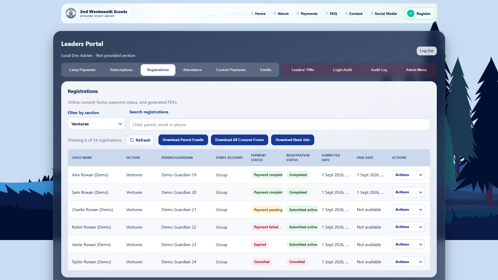
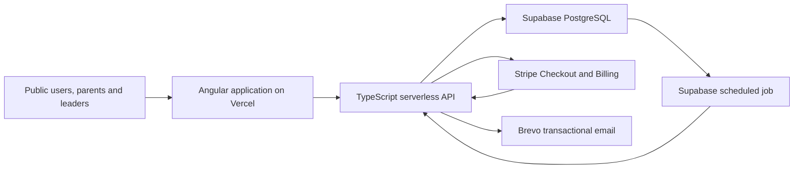
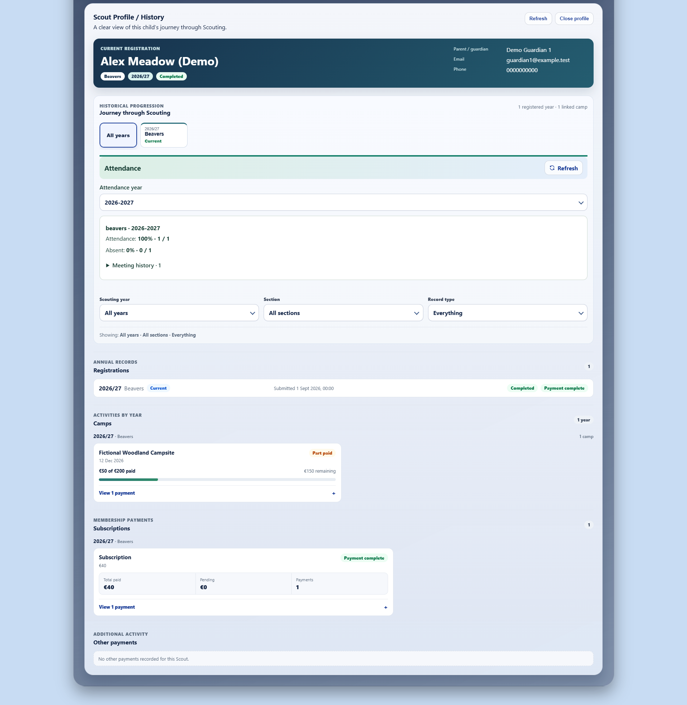
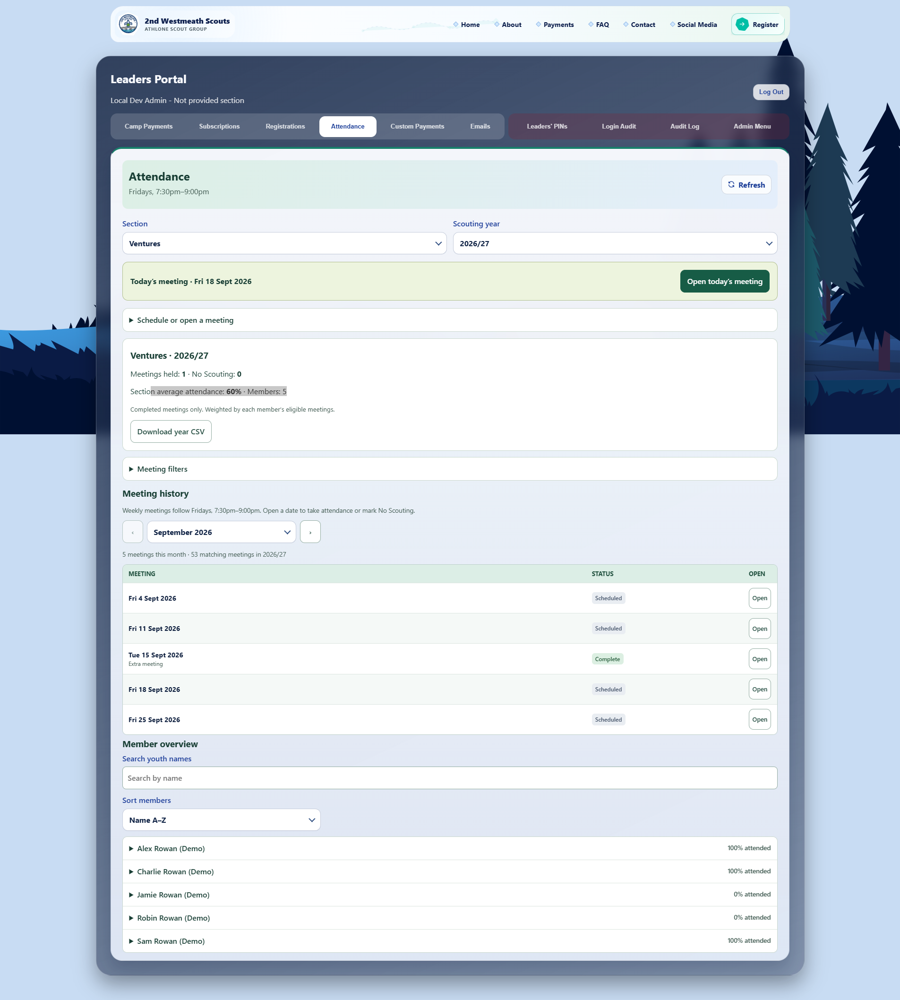

# 2nd Westmeath Scouts Platform

I designed, developed and maintain the platform as Volunteer Software Developer & IT Administrator for [2nd Westmeath Scouts](https://2wh.ie).

## Project context

This is a production platform used by 2nd Westmeath Scouts. It supports the public website and operational workflows for parents and leaders, including registration, payments, attendance and administration. This repository contains technical documentation and privacy-safe screenshots; the production source code and operational data remain private.

*Public website homepage. The hero video is omitted here to avoid displaying identifiable youth imagery.*

## What I built

- A responsive public website covering the group, its sections, activities, safeguarding information and parent resources.
- A registration and consent workflow with versioned declarations, server-side validation, payment hand-off and generated consent documents.
- A protected leader portal for registrations, camps, subscriptions, custom payment requests, attendance, email management and auditing.
- A stable member history that connects annual registrations, attendance and relevant payment records without depending on a single year’s form submission.
- Account-aware Stripe payment workflows for the group and its sections, including Checkout, recurring subscriptions, customer self-service, webhook processing and reconciliation.
- Database-backed transactional email processing with retry, suppression and delivery-history support.

*Leaders Portal registration view using synthetic/demo data across completed, payment-pending, payment-failed, expired and cancelled states.*

## Architecture

The browser communicates with the application API rather than directly with the database. Stripe webhook events update payment state after signature verification, while scheduled database work invokes a protected email worker. More detail is available in [Architecture](docs/architecture.md).

## Engineering workflows

- Registration state, consent state and payment state are kept separate so that an incomplete or failed payment does not corrupt the submitted registration record.
- Payment records are associated with the correct group or section account, and reconciliation repairs missed or delayed provider events without duplicating completed work.
- Member links are created only when a historical match is unambiguous. Uncertain records remain available for review instead of being silently merged.

  

  *Synthetic Scout profile combining current registration, progression, attendance, camp payment state, subscriptions and other activity history.*

- Attendance eligibility is derived from registration membership periods, while saved rosters preserve historical attendance records.

  

  *Ventures attendance workflow using demo data, including meeting history, attendance statistics, member overview and scheduled/completed meetings.*

- Email jobs use persisted delivery state so retries and provider updates can be handled without sending blindly.
- Restricted reads, changes, downloads, exports and denied operations produce server-written audit records appropriate to the action.

## Technology

| Area | Technology |
| --- | --- |
| Frontend | Angular 21, TypeScript, SCSS, RxJS, Angular signals and reactive forms |
| API | TypeScript serverless functions on Vercel |
| Data | Supabase PostgreSQL, SQL migrations, functions and triggers |
| Payments | Stripe Checkout, Billing Portal, subscriptions and webhooks |
| Email | Brevo with a database-backed delivery workflow |
| Documents | `pdf-lib` for consent document generation |
| Deployment / CI | Vercel and GitHub Actions |
| Testing | Jasmine/Karma, Vitest, pgTAP and Playwright |

## Security, privacy and testing

Sensitive data is processed behind server-side authorization and section-scoped access controls. Application tables are not exposed directly to browser clients, payment card details are handled by Stripe, and restricted operations are audited. This public repository omits authentication mechanics, secrets, personal data, sensitive schemas and operational configuration. See [Security and privacy](docs/security-and-privacy.md).

Testing covers frontend behaviour, API logic, database policies and functions, mocked browser journeys, and isolated end-to-end flows using synthetic data and fake payment services. Pull requests run linting, API type checks, API tests, a production build and both browser suites in CI. See [Testing strategy](docs/testing.md).

## Documentation

- [Architecture and data flows](docs/architecture.md)
- [Feature workflows](docs/features.md)
- [Security and privacy](docs/security-and-privacy.md)
- [Testing strategy](docs/testing.md)
