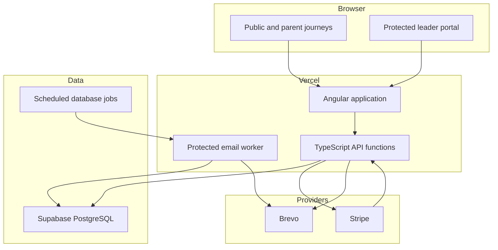
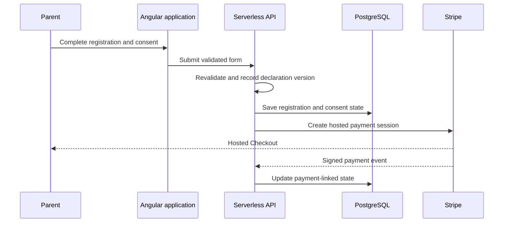

# Architecture and data flows

## Runtime boundaries

The platform is an Angular single-page application deployed with Vercel. Public pages and the protected leader interface share the same frontend, while lazy-loaded routes keep operational screens out of the initial public bundle.

TypeScript serverless functions form the application boundary for database access, authorization and third-party integrations. Browser code does not connect directly to Supabase PostgreSQL. Database access from the application is server-side, and application tables are protected from public client roles.

## Registration and consent

Registration, consent and payment are related but distinct states. This permits a submitted registration to be resumed when payment is incomplete, and prevents a provider failure from discarding the consent record. Consent documents are generated from the stored declaration and signature data; parent access to a document is tied to a verified paid session, while leader access remains authorized and audited.

## Member history

A stable Scout record sits above year-specific registrations. It provides a consistent history across annual registration, camps, subscriptions, custom payments and attendance. Links are established conservatively: ambiguous records are held for review instead of being automatically combined.

Identity-resolution fields and matching rules are intentionally not documented publicly.

## Payments and reconciliation

The group and each section have separate payment contexts. Server-side routing selects the appropriate context for registrations, section activity, subscriptions and custom requests. Hosted Checkout handles payment collection, and the Billing Portal supports subscription self-service.

Provider events are signature-verified before they update local records. Processing is designed to tolerate duplicate or delayed events. Reconciliation can run incrementally or across a wider period, uses a database-backed coordination lock, and records items that require review rather than guessing at an association.

## Attendance

Meeting rosters are calculated from membership periods established by registration. A saved roster stores the names and meeting state used at that time, so later registration changes do not rewrite historical attendance.

Attendance writes are performed atomically in the database. Version checks detect competing edits, and server-side validation prevents changes to an invalid roster or future meeting. Ventures attendance extends the shared model with notified absences and uniform tracking.

## Transactional email

Email requests are persisted before delivery. A protected worker claims eligible work, reloads current application state, applies suppression rules and records the delivery result. Failed work can be retried without losing its history. Provider delivery events feed the email-management view used by authorized leaders.

Scheduled work is initiated by Supabase and delivered through the application worker on Vercel. Exact schedules, credentials and endpoint details are not documented publicly.

## Deployment boundaries

Production deployment is separate from local and isolated test environments. GitHub Actions validates pull requests with static analysis, builds and automated tests. Production promotion remains a deliberate operation rather than an automatic consequence of every change to the main branch.
